# Appearance

## General configuration items

1. `Appearance.pageContainerTitleBarItemWidth` The height and width of the title bar of the bottom pop-up page. Please search for `PageContainerTitleBar.swift` in Xcode files.

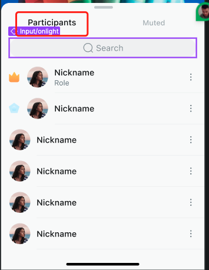

2. `Appearance.pageContainerConstraintsSize` The width and height of the bottom pop-up page. You can search for this property in `Xcode show the finder navigation` to find files that use this property. Also, search for `PageContainersDialogController.swift` in Xcode files to locate the classes that use this property.

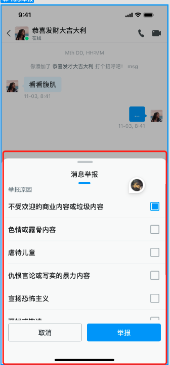

3. `Appearance.alertContainerConstraintsSize` The width and height of the Alert dialog that is centered on the page. You can search for `AlertController.swift` in Xcode files to find the classes that use this property.

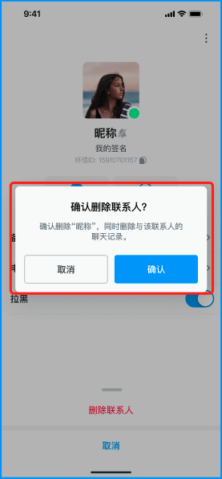

4. `Appearance.alertStyle` The rounded corner style of the Alert dialog: large rounded corner or small rounded corner.

5. `Appearance.primaryHue` Main color hue, used for the background color of buttons, input boxes and other controls.

6. `Appearance.secondaryHue` Secondary color hue, used for the background color of buttons, input boxes and other controls.

7. `Appearance.errorHue` Color hue for errors.

8. `Appearance.neutralHue` Neutral hue.

9. `Appearance.neutralSpecialHue` Neutral special hue.

10. `Appearance.avatarRadius` Avatar corner radius: extra small, small, medium, and large.

11. `Appearance.actionSheetRowHeight` Row height of ActionSheet cell.
    
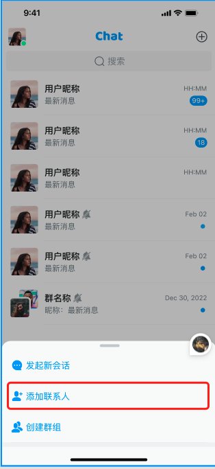

12. `Appearance.avatarPlaceHolder` Avatar placeholder

## Configuration items on the conversation list

1. `Appearance.conversation.rowHeight` Height of the conversation list cell.

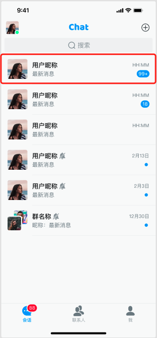

2. `Appearance.conversation.swipeLeftActions` Menu items shown when sliding a conversation to the left.

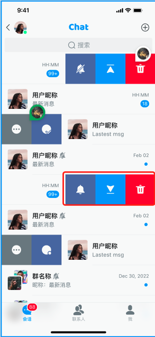

3. `Appearance.conversation.swipeRightActions` Menu items shown when sliding a conversation to the right.

4. `Appearance.conversation.singlePlaceHolder` Avatar placeholder of a one-to-one chat conversation. 
   
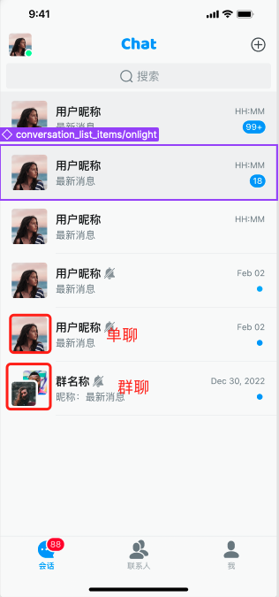

5. `Appearance.conversation.groupPlaceHolder` Avatar placeholder of a group chat conversation. 

6. `Appearance.conversation.dateFormatToday` Date format of today.

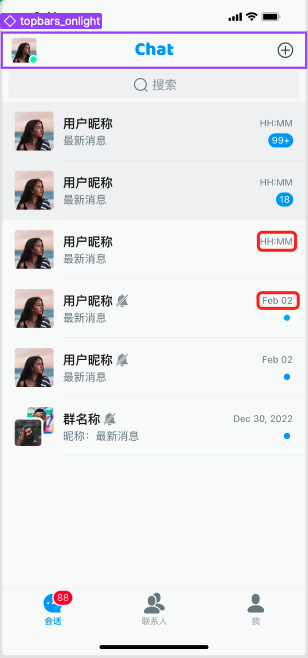

7. `Appearance.conversation.dateFormatOtherDay` Format of a data other than today.

8. `Appearance.conversation.moreActions` Menu items of the ActionSheet that appear after you swipe the conversation towards the right and click the `...` menu item.

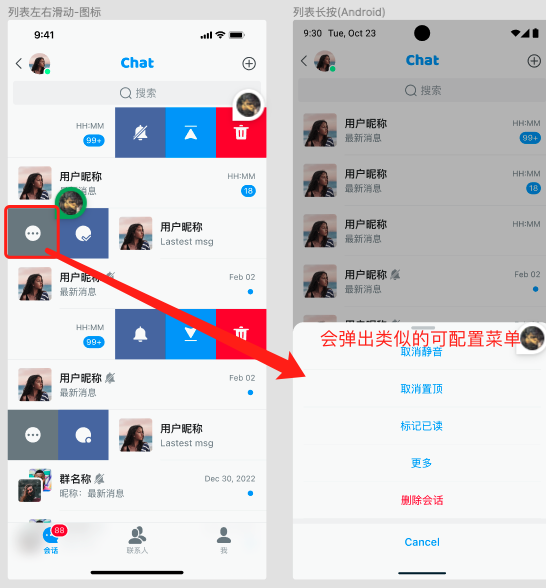

9. `Appearance.conversation.listMoreActions` Menu items of ActionSheet that appear after you click `+` in the upper right corner of the conversation list.

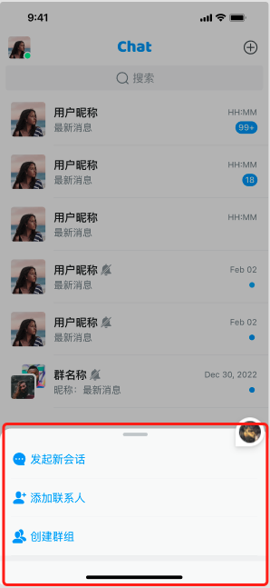

## Configuration items on the contact list and subsequent pages

1. `Appearance.contact.rowHeight` Height of a contact list cell. 

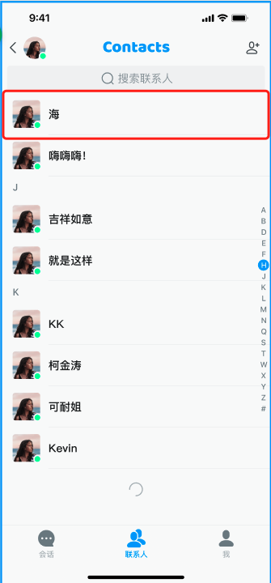

2. `Appearance.contact.headerRowHeight` Height of the header cell of the contact list.

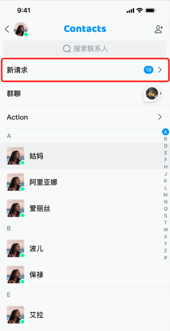

3. `Appearance.contact.listHeaderExtensionActions` Data source of the header list of the contact list.

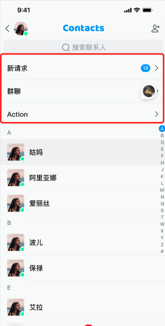

4. `Appearance.contact.detailExtensionActionItems` Configuration menu items of the header on the contact details page or group details page, including such main functions as chat and audio and video calls.

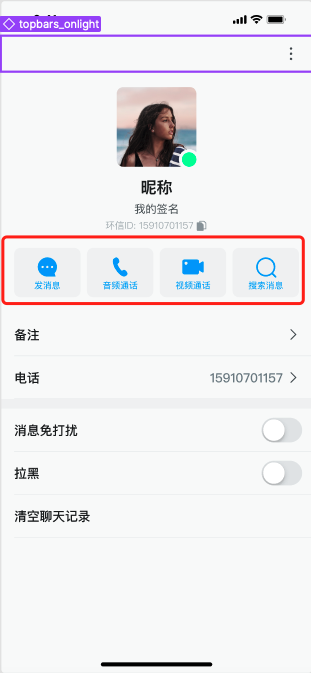

5. `Appearance.contact.moreActions` Menu items of the ActionSheet shown after clicking `...` in the upper-right corner of the contact details page or group details page.

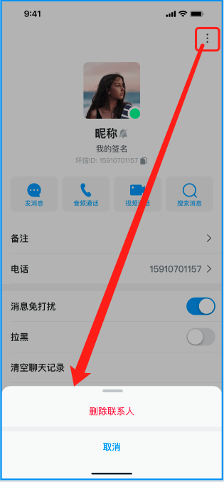

## Configuration items on the chat page

1. `Appearance.chat.maxInputHeight` Maximum height of the input box of the chat page.

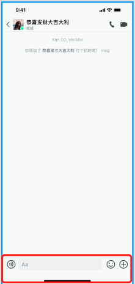

2. `Appearance.chat.inputPlaceHolder` Default placeholder of the input box of the chat page.

3. `Appearance.chat.inputBarCorner` Rounded corners of the input box of the chat page. 

4. `Appearance.chat.bubbleStyle` Message bubble styles on the chat page: with an arrow and with multiple rounded corners.

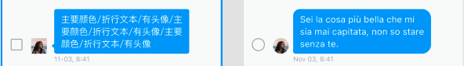

5. `Appearance.chat.contentStyle` Array of configuration items for the message content shown on the chat page. You can remove unwanted functions.

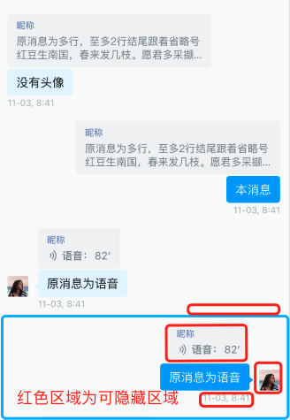

6. `Appearance.chat.messageLongPressedActions` ActionSheet menu items shown after long pressing a message on the chat page.

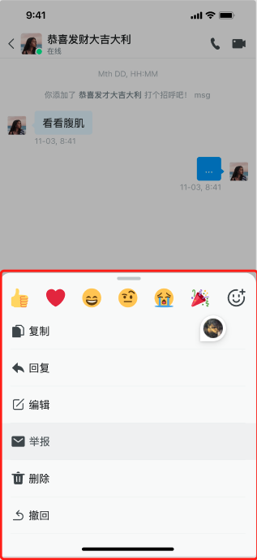

7. `Appearance.chat.reportSelectionTags` Report types shown when reporting a message on the chat page.

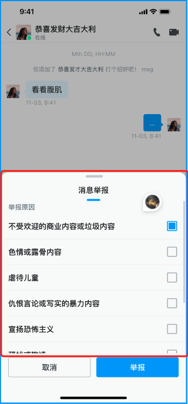

8. `Appearance.chat.reportSelectionReasons` Reasons for reporting a message on the chat page.

9. `Appearance.chat.inputExtendActions` ActionSheet menu items shown after clicking `+` on the right side of the input box on the chat page.

10. `Appearance.chat.dateFormatToday` Date format of today on the chat page.

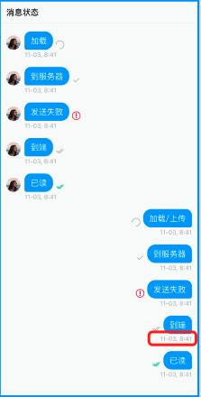

11. `Appearance.chat.dateFormatOtherDay` Format of other dates than today on the chat page.

12. `Appearance.chat.audioDuration` Maximum recording duration of a voice message on the chat page.

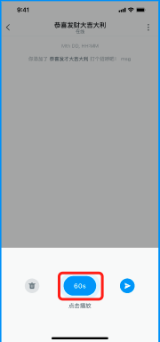

13. `Appearance.chat.receiveAudioAnimationImages` Animated image shown when the recipient's voice message is played on the chat page.

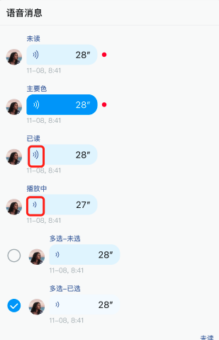

14. `Appearance.chat.sendAudioAnimationImages` Animated image shown when the sender's voice message is played on the chat page.

15. `Appearance.chat.receiveBubbleColor` Color of the message cell of the recipient on the chat page.

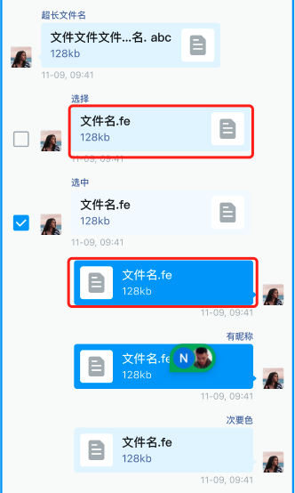

16. `Appearance.chat.sendBubbleColor` Color of the message cell of the sender on the chat page.

17. `Appearance.chat.receiveTextColor` Color of the message text of the recipient on the chat page.

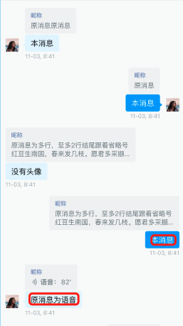

18. `Appearance.chat.sendTextColor` Color of the message text of the sender on the chat page.

19. `Appearance.chat.imageMessageCorner` Rounded corners of the image message on the chat page.

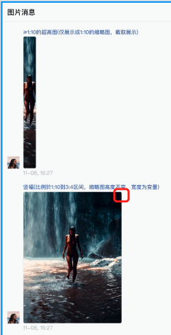

20. `Appearance.chat.imagePlaceHolder` Placeholder of the image message on the chat page.

21. `Appearance.chat.videoPlaceHolder` Placeholder of the video message on the chat page.

22. `Appearance.chat.recallExpiredTime` Message recall duration on the chat page.

23. `Appearance.chat.newMessageSoundPath` Path of the audio file played when a new message is received on the chat page.

