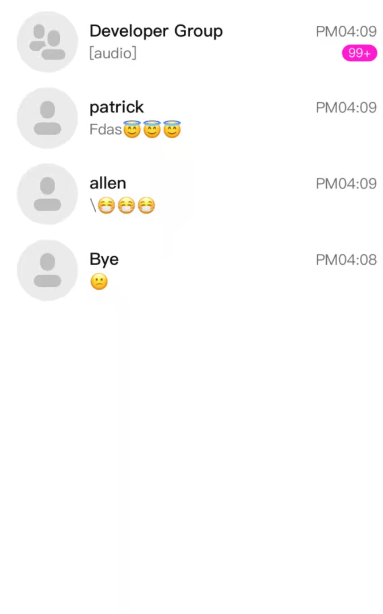

# AgoraChatUIKit iOS 使用指南

# Get Started with Agora Chat UIKit iOS

## 功能描述   Understand the tech

chat-uikit 是基于声网 IM SDK 的一款 UI 组件库，它提供了一些通用的 UI 组件，“会话列表”和“聊天界面”，开发者可根据实际业务需求通过该组件库快速地搭建自定义 IM 应用。chat-uikit 中的组件在实现 UI 功能的同时，调用 IM SDK 相应的接口实现 IM 相关逻辑和数据的处理，因而开发者在使用 chat-uikit 时只需关注自身业务或个性化扩展即可。

chat-uikit is a UI component library built on top of Agora IM SDK. This library provides a collection of general UI components, a conversation list, and a chat UI, allowing developers to rapidly tailor-make an IM application to suit actual business needs. 
In addition to providing UI components for UI creation, chat-uikit also calls interfaces in the IM SDk to implement related IM logics and data processing. Therefore, when using this library, developers only need to focus on their own business and personalized extensions.


chat-uikit 源码地址：   URL of chat-uikit source code:

- https://github.com/AgoraIO-Usecase/AgoraChat-UIKit-ios.git chat-uikit source code

使用 chat-uikit 的声网 IM App 地址：  URL of Agora IM App using chat-uikit:

- https://github.com/AgoraIO-Usecase/AgoraChat-ios.git Agora IM 

## 重要特性
- 消息扩展功能
  - 表情消息
  - 消息子区
  - 消息引用
  - 群 @ 消息
  - 消息编辑
  - 消息撤回
  - 消息多选&合并转发
- 通用功能
  - 会话列表
  - 聊天
  - 语音消息
  - 正在输入通知
  - 已发送回执
  - 已读回执

## 前提条件  Prerequisites

支持系统版本要求： Compatible system versions:

- chat-uikit 支持 iOS 11.0及以上系统版本    chat-uikit: iOS 11.0 and later
- AgoraChatIM 支持 iOS 11.0及以上系统版本   AgoraChatIM: iOS 11.0 and later

## 集成步骤   Integrate AgoraChatUIKit iOS into your project

### 一、导入  

#### 安装 Cocoapods 工具  Install CocoaPods

1. 开始前确保你已安装 Cocoapods。参考 [Getting Started with CocoaPods](https://guides.cocoapods.org/using/getting-started.html#getting-started) 安装说明。  Install CocoaPods. 
1. For details, see [Getting Started with CocoaPods](https://guides.cocoapods.org/using/getting-started.html#getting-started).

2. 在终端里进入项目根目录，并运行 `pod init` 命令。项目文件夹下会生成一个 `Podfile` 文本文件。 
2. On the terminal, access the root directory of the project and run the `pod init` command. Then the text file `Podfile` will be generated in the project folder.
 
有两种方式集成，使用 pod 方式集成 chat-uikit 或者源码集成 chat-uikit，具体步骤如下：
chat-uikit can be integrated using a pod or source code. The detailed procedures are as follows:

#### 使用 pod 方式集成 chat-uikit     Integrate chat-uikit by using a pod 

1. 打开 `Podfile` 文件，添加 chat-uikit 依赖。注意将 `ProjectName` 替换为你的 Target 名称。
1. In the `Podfile` file, add dependencies of chat-uikit. Remember to replace `ProjectName` with your target name.
```
platform :ios, '11.0'

# Import CocoaPods sources
source 'https://github.com/CocoaPods/Specs.git'

target 'ProjectName' do
    pod 'chat-uikit'
end
```

1. 在终端 Terminal cd 到 podfile 文件所在目录，执行如下命令集成 SDK。

1. Run the `Terminal cd` command on the terminal to switch to the directory where the `Podfile` file is located. Then run the following command to integrate the SDK.

```
pod install
```

1. 成功安装后，Terminal 中会显示 `Pod installation complete!`，此时项目文件夹下会生成一个 `xcworkspace` 文件，打开新生成的 `xcworkspace` 文件运行项目。


1. After pod installation is complete, the message `Pod installation complete!` will be displayed on the terminal. At this time, the `xcworkspace` file will be generated in the project folder. You can open this new file to run the project.

注意：
chat-uikit 依赖于 AgoraChat SDK，其中包含了拍照，发语音，发图片，发视频，发附件等功能，需要使用录音，摄像头，相册权限。需要在您项目的 info.plist 中添加对应权限。
Note:
As chat-uikit, built upon AgoraChat SDK, allows users to take photos and send voices, images, videos and attachments, it requires permissions to access the recording function, camera, and album. For this purpose, you need to add privileges on info.plist of your project.


##### 源码集成 chat-uikit   Integrate chat-uikit using source code

1. github 下载源码   Download source code from github:

源码下载地址：https://github.com/AgoraIO-Usecase/AgoraChat-UIKit-ios.git
Download URL: https://github.com/AgoraIO-Usecase/AgoraChat-UIKit-ios.git

Terminal command: git clone https://github.com/AgoraIO-Usecase/AgoraChat-UIKit-ios.git

1. 项目添加 chat-uikit 源码依赖       Add source code dependencies of chat-uikit in the project.

打开 `Podfile` 文件，在 podfile 文件里添加 chat-uikit 依赖。

In the `Podfile` file, add dependencies of chat-uikit.

Podfile 文件示例：     `Podfile` file example: 

```
platform :ios, '11.0'

source 'https://github.com/CocoaPods/Specs.git'

target 'ProjectName' do
    pod 'chat-uikit',  :path => "../chat-uikit"
end

#chat-uikit path 路径需指向 chat-uikit.podspec 文件所在目录  

#The chat-uikit path should point to the directory where chat-uikit.podspec resides.

```

1. 项目集成本地 chat-uikit 源码          Integrate the local source code of chat-uikit in the project.

终端 Terminal cd 到 Podfile 文件所在目录，执行 pod install 命令在项目中安装 chat-uikit 本地源码

执行完成后，则在 Xcode 项目目录 Pods/Development Pods/ 可找到 chat-uikit 源码

可对源码进行符合自己项目目标的自定义修改

Run the `Terminal cd` command on the terminal to switch to the directory where the `Podfile` file is located. Then run the `pod install` command to install local source code of chat-uikit.

After the command execution is complete, you can find the source code of chat-uikit in the Xcode project directory Pods/Development Pods/ and adapt it to align with your project objectives.


### 二、添加权限    II. Add privileges

在项目 `info.plist` 中添加相关权限：

Add related privileges in the `info.plist` project:

```
Privacy - Photo Library Usage Description //相册权限    Album privileges.
Privacy - Microphone Usage Description //麦克风权限     Microphone privileges.
Privacy - Camera Usage Description //相机权限    Camera privileges.
App Transport Security Settings -> Allow Arbitrary Loads //开启网络服务  Enable the network service.
```

### 参考   Reference

如果在源码自定义过程中有任何通用自定义都可以给我们仓库 https://github.com/AgoraIO-Usecase/AgoraChat-UIKit-ios.git 提交代码，成为社区贡献者。

If you have made any general customizations during source code customization, please submit them to our repository https://github.com/AgoraIO-Usecase/AgoraChat-UIKit-ios.git to become a contributor of our community.


### 三、初始化 III. Initialization

#### 1. 引入头文件 Import the header file

```
#import <chat-uikit/EaseChatKit.h>
```

#### 2. 初始化chat-uikit     Initialize chat-uikit

在工程的 AppDelegate.m 中的以下方法中调用 EaseChatKitManager 的初始化方法一并初始化声网 AgoraChat sdk。(注: 此方法无需重复调用)
In AppDelegate.m in the project, call the EaseChatKitManager initialization method in the following method to initialize AgoraChat SDK (note that it is unnecessary to repeatedly call this method).
```
(BOOL)application:(UIApplication *)application didFinishLaunchingWithOptions:(NSDictionary *)launchOptions {
	// Override point for customization after application launch.
	AgoraChatOptions *options = [AgoraChatOptions optionsWithAppkey:@"The AppKey you created"];   
	[EaseChatKitManager initWithAgoraChatOptions:options];
	//登录操作   Login operation
	return YES;
}
```

#### 3. 接收未读数回调 Callback for receiving the number of unread messages in all conversations

EaseChatKitManagerDelegate 主要是会话未读数回调。 用户需要注册自己的类到 EaseChatKitManagerDelegate 才可收到未读总数变化回调。

EaseChatKitManagerDelegate is the callback for the total number of unread messages in all conversations.
You need to register your class in EaseChatKitManagerDelegate to receive the callback for the change to the total number of unread messages.

```
/*
 @method
 @brief   会话未读总数变化的回调。 Callback triggered when the total number of unread messages is changed.
 @param   unreadCount     当前会话列表的消息未读总数。The total number of unread messages in all conversations.
 */

- (void)conversationsUnreadCountUpdate:(NSInteger)unreadCount;
```

### 四、快速搭建 IV. Rapid Setup

#### 聊天会话快速搭建  Rapidly set up a chat conversation

##### 1. 导入头文件  Import the header file

```
#import <chat-uikit/EaseChatKit.h>
```

##### 2. 加载会话页面 Load the conversation page

chat-uikit 提供聊天会话 ViewController，可以通过创建 EaseChatViewController 实例，并嵌入进自己的聊天控制器方式（参考 AgoraChatIM 中 ACDChatViewController.m）实现对 chat-uikit 聊天会话的集成。 创建聊天会话页面实例，需传递用户‘会话 ID’或‘群 ID’ ，会话类型（AgoraChatConversationType）以及聊天视图配置数据模型 EaseChatViewModel 实例。

chat-uikit provides ViewController for chat conversations. You can create an EaseChatViewController instance and embed your chat controller in this instance to integrate the chat conversation function of chat-uikit. To create a chat conversation page instance, you need to pass `Conversation ID`, `Group ID`, conversation type (AgoraChatConversationType), and EaseChatViewModel (chat view configuration data model) instance.


```
EaseChatViewModel *viewModel = [[EaseChatViewModel alloc]init];
EaseChatViewController *chatController = [EaseChatViewController initWithConversationId:@"custom"
                                              conversationType:AgoraChatConversationTypeChat
                                                  chatViewModel:viewModel];
[self addChildViewController:chatController];
[self.view addSubview:chatController.view];
chatController.view.frame = self.view.bounds;
```

#### 会话列表快速搭建 Rapidly set up the conversation list

##### 1. 导入头文件  Import the header file

```
#import <chat-uikit/EaseChatKit.h>
```

##### 2.加载会话列表 Load the conversation list

在自己聊天控制器内可嵌入 chat-uikit 的会话列表 EaseConversationsViewController.
创建会话列表实例，实例化会话列表必须传入会话列表视图数据配置模型 EaseConversationViewModel 实例。

In your chat controller, you can embed EaseConversationsViewController for the conversation list in the chat-uikit.
Create a conversation list instance. During conversation list instantiation, the EaseConversationViewModel (conversation list view data configuration model) instance must be passed in.

```
EaseConversationViewModel *viewModel = [[EaseConversationViewModel alloc] init];

EaseConversationsViewController *easeConvsVC = [[EaseConversationsViewController alloc] initWithModel:viewModel];
easeConvsVC.delegate = self;
[self addChildViewController:easeConvsVC];
[self.view addSubview:easeConvsVC.view];
[easeConvsVC.view mas_makeConstraints:^(MASConstraintMaker *make) {
    make.size.equalTo(self.view);
}];
```

### 设置样式  Set styles

#### 聊天会话样式配置  Set chat conversation styles

聊天会话可配置参数如下：   For a chat conversation, you need to configure the following parameters:

```
// Chat view background color
@property (nonatomic, strong) UIColor *chatViewBgColor;

// Timeline background color
@property (nonatomic, strong) UIColor *msgTimeItemBgColor;

// Timeline font
@property (nonatomic, strong) UIFont *msgTimeItemFont;

// Timeline font color
@property (nonatomic, strong) UIColor *msgTimeItemFontColor;

// Bubble background image of received message
@property (nonatomic, strong) UIImage *receiverBubbleBgImage;

// Bubble background image of sent message
@property (nonatomic, strong) UIImage *senderBubbleBgImage;

// Right align image/video/attachment message bubble cornerRadius
@property (nonatomic) BubbleCornerRadius rightAlignmentCornerRadius;

// Left align image/video/attachment message bubble cornerRadius
@property (nonatomic) BubbleCornerRadius leftAlignmentCornerRadius;

// Message bubble background protected area
@property (nonatomic) UIEdgeInsets bubbleBgEdgeInsets;

// Sent message font color
@property (nonatomic, strong) UIColor *sentFontColor;

// Receiver message font Color
@property (nonatomic, strong) UIColor *reveivedFontColor;

// Text message font
@property (nonatomic) UIFont *textMessaegFont;

// Input menu background color and input menu gradient color mutually exclusive. display background color first
@property (nonatomic, strong) UIColor *inputMenuBgColor;

// Input menu type
@property (nonatomic) EaseInputMenuStyle inputMenuStyle;

// Input menu extend view model
@property (nonatomic) EaseExtendMenuViewModel *extendMenuViewModel;

// Display sent avatar
@property (nonatomic) BOOL displaySentAvatar;

// Display received avatar
@property (nonatomic) BOOL displayReceivedAvatar;

// Display sent name
@property (nonatomic) BOOL displaySentName;

// Display received name
@property (nonatomic) BOOL displayReceiverName;

// Avatar style
@property (nonatomic) EaseChatAvatarStyle avatarStyle;

// Avatar cornerRadius Default: 0 (Only avatar type RoundedCorner)
@property (nonatomic) CGFloat avatarCornerRadius;

// Chat view message alignment
@property (nonatomic) EaseAlignmentStyle msgAlignmentStyle;
```

其中参数：extendMenuViewModel 输入区的功能数据配置模型(聊天会话页相机，相册等区域)内含可配参数：
extendMenuViewModel (the model for extension function data configuration in the input area, like the camera or album area on the chat conversation page) contains the following configurable parameters:  

```
/*
 *  inputMenu "+" extend view style
 */
typedef NS_ENUM(NSInteger, EaseExtendViewStyle) {
    EaseInputMenuExtFuncView = 1,  //inputMenu view
    EasePopupView,                //viewcontroller popup view
};

// Icon background color
@property (nonatomic, strong) UIColor *iconBgColor;

// View background color
@property (nonatomic, strong) UIColor *viewBgColor;

// Font color
@property (nonatomic, strong) UIColor *fontColor;

// Font size
@property (nonatomic, assign) CGFloat fontSize;

// View size
@property (nonatomic, assign) CGSize collectionViewSize;

// Extend view style
@property (nonatomic) EaseExtendViewStyle extendViewStyle;
```

其中参数：inputMenuStyle（输入区）包含五种样式：

inputMenuStyle (input area) can be one of the following styles:

```
/*
 *  Input menu style
 */
typedef NS_ENUM(NSInteger, EaseInputMenuStyle) {
    EaseInputMenuStyleAll = 1,          //All functions.
    EaseInputMenuStyleNoAudio,          //No audio.
    EaseInputMenuStyleNoEmoji,          //No emoji.
    EaseInputMenuStyleNoAudioAndEmoji,  //No audio and emoji.
    EaseInputMenuStyleOnlyText,         //Only text.
};
```

其中参数：EaseAlignmentStyle （消息排列方式,仅群聊可生效）包含两种类型
The EaseAlignmentStyle parameter (the message alignment mode, valid only for group chats) can be either of the following message alignment modes:

```
/*
 *  Message alignment
 */
typedef NS_ENUM(NSInteger, EaseAlignmentStyle) {
    EaseAlignmentLeft_Right = 1,     //Left Right alignment
    EaseAlignmentlAll_Left,          //The left alignment
};
```

实例化的聊天控制器可通过重置视图 UI 配置模型刷新页面。
An instantiated chat controller can refresh the chat page by resetting the chat view UI configuration model.


```
//重置聊天控制器。  Reset the chat controller.

- (void)resetChatVCWithViewModel:(EaseChatViewModel *)viewModel;
```

##### 聊天会话自定义样式示例    Example of custom chat conversation styles

chat-uikit 显示的是默认的UI样式，以下是对聊天会话样式进行自定义配置示例：
chat-uikit uses default UI styles. The following is an example of custom chat conversation style configurations.

- 默认样式示例： Example of default styles:

只需创建 EaseChatViewModel 实例，并作为参数传入聊天页面 EaseChatViewController 的构造方法。
You only need to create an EaseChatViewModel instance which will be passed as a parameter to the constructor in EaseChatViewController for the chat page.


```
EaseChatViewModel *viewModel = [[EaseChatViewModel alloc]init]; //默认样式   Default styles
EaseChatViewController *chatController = [EaseChatViewController initWithConversationId:@"Conversation ID" conversationType:AgoraChatConversationTypeChat chatViewModel:viewModel];
```

默认样式的聊天页面示例图： Example of a chat page with default styles:

// TODO:合并之后确定地址


- 自定义样式配置示例：     Configuration example of a chat page with custom styles:

创建 EaseChatViewModel 实例，修改该实例的可配置样式参数，将实例传入聊天页面 EaseChatViewController 的构造方法。
Create an EaseChatViewModel instance with custom styles and pass this instance to the constructor of EaseChatViewController for the chat page.

```
EaseChatViewModel *viewModel = [[EaseChatViewModel alloc]init];
viewModel.chatViewBgColor = [UIColor systemGrayColor];  //聊天页背景色   The chat background color.
viewModel.inputMenuBgColor = [UIColor systemPinkColor]; //输入区背景色   The background color of the input area.
viewModel.sentFontColor = [UIColor redColor];           //发送方文本颜色 The sender's text color.
viewModel.inputMenuStyle = EaseInputMenuStyleNoAudio;   //输入区菜单样式 The menu style of the input area.
viewModel.msgTimeItemFontColor = [UIColor blackColor];  //消息时间字体颜色 The message time font color.
viewModel.msgTimeItemBgColor = [UIColor greenColor];    //消息时间区域背景色  The background color of the message time area.
EaseChatViewController *chatController = [EaseChatViewController initWithConversationId:@"会话 ID" conversationType:AgoraChatConversationTypeChat chatViewModel:viewModel];
```

部分自定义样式配置示例图： Configuration example of some custom styles:

// TODO:合并之后确定地址


关于更多 API 介绍请参考 EaseChatViewController 提供的 API，以及 EaseChatViewControllerDelegate 协议中的回调方法 API。
For details on more APIs, see APIs provided by EaseChatViewController and callback APIs in the EaseChatViewControllerDelegate protocol.

#### 会话列表样式配置 Conversation list style configuration

会话列表可配置参数如下： For the conversation list, you can configure the following parameters:

```
// display chatroom
@property (nonatomic) BOOL displayChatroom;

// avatar style
@property (nonatomic) EaseChatAvatarStyle avatarType;

// avatar size
@property (nonatomic) CGSize avatarSize;

// avatar cornerRadius
@property (nonatomic) CGFloat avatarCornerRadius;

// avatar location
@property (nonatomic) UIEdgeInsets avatarEdgeInsets;

// conversation top style
@property (nonatomic) EaseChatConversationTopStyle conversationTopStyle;

// conversation top bgColor
@property (nonatomic, strong) UIColor *conversationTopBgColor;

// conversation top icon
@property (nonatomic, strong) UIImage *conversationTopIcon;

// top icon location
@property (nonatomic) UIEdgeInsets conversationTopIconInsets;

// top icon size
@property (nonatomic) CGSize conversationTopIconSize;

// nickname font
@property (nonatomic, strong) UIFont *nameLabelFont;

// nickname color
@property (nonatomic, strong) UIColor *nameLabelColor;

// nickname location
@property (nonatomic) UIEdgeInsets nameLabelEdgeInsets;

// message detail font
@property (nonatomic, strong) UIFont *detailLabelFont;

// message detail text font
@property (nonatomic, strong) UIColor *detailLabelColor;

// message detail location
@property (nonatomic) UIEdgeInsets detailLabelEdgeInsets;

// message time font
@property (nonatomic, strong) UIFont *timeLabelFont;

// message time color
@property (nonatomic, strong) UIColor *timeLabelColor;

// message time location
@property (nonatomic) UIEdgeInsets timeLabelEdgeInsets;

// needs displayed Unread messages number
@property (nonatomic) BOOL needsDisplayBadge;

// message unread position
@property (nonatomic) EaseChatUnReadCountViewPosition badgeLabelPosition;

// message unread style
@property (nonatomic) EaseChatUnReadBadgeViewStyle badgeViewStyle;

// message unread font
@property (nonatomic, strong) UIFont *badgeLabelFont;

// message unread text color
@property (nonatomic, strong) UIColor *badgeLabelTitleColor;

// message unread bgColor
@property (nonatomic, strong) UIColor *badgeLabelBgColor;

// message unread angle height
@property (nonatomic) CGFloat badgeLabelHeight;

// message unread red dot height
@property (nonatomic) CGFloat badgeLabelRedDotHeight;

// message unread center position deviation
@property (nonatomic) CGVector badgeLabelCenterVector;

// message unread display limit, display after the upper limit is exceeded xx+
@property (nonatomic) int badgeMaxNum;

// no disturb image
@property (nonatomic, strong) UIImage *noDisturbImg;

// no disturb image location
@property (nonatomic) UIEdgeInsets noDisturbImgInsets;

// no disturb image size
@property (nonatomic) CGSize noDisturbImgSize;
```

会话列表父类可配置参数如下：
The parent class of the conversation class involves the following configurable parameters:

```
// Whether to refresh by pull-down
@property (nonatomic) BOOL canRefresh;

// TableView bg view
@property (nonatomic, strong) UIView *bgView;

// UITableViewCell bg color
@property (nonatomic, strong) UIColor *cellBgColor;

// UITableViewCell cocation of the dividing line
@property (nonatomic) UIEdgeInsets cellSeparatorInset;

// UITableViewCell color of the dividing line
@property (nonatomic, strong) UIColor *cellSeparatorColor;
```

##### 会话列表自定义样式示例  Example of a conversation list with custom styles

chat-uikit 显示的是默认的UI样式，以下是对会话列表样式进行自定义配置示例：
chat-uikit uses default UI styles. The following is a configuration example of a conversation list with custom styles.

- 默认样式示例： Example of a conversation list with default styles:

只需创建 EaseConversationViewModel 实例，并作为参数传入聊天页面 EaseConversationsViewController 的构造方法。
You only need to create an EaseConversationViewModel instance which will be passed as a parameter to the constructor in EaseConversationsViewController for the chat page.
 
```
EaseConversationViewModel *viewModel = [[EaseConversationViewModel alloc] init]; //默认样式   Default styles
EaseConversationsViewController *chatsVC = [[EaseConversationsViewController alloc] initWithModel:viewModel];
```

默认样式的会话列表示例图： Example of the conversation list with default styles:

// TODO:合并之后确定地址



- 自定义样式配置示例： Configuration example of custom styles:

创建 EaseConversationViewModel 实例，修改该实例的可配置样式参数，将实例传入聊天页面 EaseChatViewController 的构造方法。
Create an EaseConversationViewModel instance with custom styles and pass this instance to the constructor of EaseConversationsViewController for the chat page.
```
EaseConversationViewModel *viewModel = [[EaseConversationViewModel alloc] init];
viewModel.canRefresh = YES;                                //是否可刷新 Whether to enable refresh.
viewModel.badgeLabelCenterVector = CGVectorMake(-16, 0);   //未读数角标偏移量 The Badge offset of the number of unread messages.
viewModel.avatarType = Rectangular;                        //头像类型 The avatar type. 
viewModel.nameLabelColor = [UIColor blueColor];            //会话名称颜色 The color of the conversation name.
viewModel.detailLabelColor = [UIColor redColor];           //会话详情颜色 The color of conversation details.
viewModel.timeLabelColor = [UIColor systemPinkColor];      //会话时间颜色 The color of conversation time.
viewModel.cellBgColor = [UIColor lightGrayColor];          //会话 cell 背景色 The background color of the conversation cell.
viewModel.badgeLabelBgColor = [UIColor purpleColor];       //未读数背景色 The background color of the number of unread messages.

EaseConversationsViewController *chatsVC = [[EaseConversationsViewController alloc] initWithModel:viewModel];
```

部分自定义样式配置示例图：Configuration example of some custom styles:

// TODO:合并之后确定地址


关于更多 API 介绍请参考 EaseConversationsViewController 提供的 API，以及 EaseConversationsViewControllerDelegate 协议中的回调方法 API。
For details on more APIs, see APIs provided by EaseConversationsViewController and callback APIs in the EaseConversationsViewControllerDelegate protocol.

### 自定义功能扩展  Custom function extensions

#### 会话自定义功能扩展 Custom conversation function extensions

实例化 EaseConversationsViewController 之后，可选择实现 EaseConversationsViewControllerDelegate 协议（会话列表回调代理），接收 EaseConversationsViewController 的回调并做进一步的自定义实现。
After EaseConversationsViewController is instantiated, you can implement the EaseConversationsViewControllerDelegate protocol (conversation list callback delegate) to receive the callback of EaseConversationsViewController and further implement custom extensions.


```
EaseConversationsViewControllerDelegate
```

#### 自定义会话 cell 回调  Callback of a custom conversation cell

通过实现会话列表回调获取自定义消息 cell。
如果返回 nil 会显示默认；如果返回 cell 会显示用户自定义cell。
You can get the custom message cell by implementing chat control callback. 
If nil is returned, the default cell will be used; if cell is returned, a custom cell will be used.

```
/**
 * Occurs when a custom conversation cell is used.
 *
 * @param tableView        tableView of the message view. 
 * @param messageModel     The message data model.
 *
 */
- (UITableViewCell *)cellForItem:(UITableView *)tableView messageModel:(EaseMessageModel *)messageModel;
```

##### 选中消息的回调  Callback of a selected message

选中消息的回调（chat-uikit 没有对于自定义 cell 的选中事件回调，需用户自定义实现选中响应）。
Callback of a selected message (chat-uikit does provide callback for a selected message cell and you need to implement the callback yourself).

```
/**
 * Occurs when a message is selected.
 *
 * @param   message         The selected message.
 * @param   userData        The user profile contained in the selected message.
 *
 */
- (BOOL)didSelectMessageItem:(AgoraChatMessage *)message userProfile:(id<EaseUserProfile>)userData;
```

##### 用户资料回调 User profile callback

用户资料回调（头像、昵称等）。
Callback of the user profile (such as the avatar and nickname).

```
/**
 * User profile callback
 *
 * @discussion  Users will match the user ID against those in their own user system. If a match is found, the related user profile is returned; if nil is returned, the default implementation is used.
 *
 * @param   huanxinID        The user ID.
 *
 */
- (id<EaseUserProfile>)userProfile:(NSString *)huanxinID;
```

用户资料回调 AgoraChatIM Demo 中使用示例：

Example of user profile callback in the AgoraChatIM demo:

```
- (id<EaseUserProfile>)userProfile:(NSString *)huanxinID
{
    AgoraChatUserDataModel *model = nil;
    AgoraChatUserInfo* userInfo = [[UserInfoStore sharedInstance] getUserInfoById:huanxinID];
    if(userInfo) {
        model = [[AgoraChatUserDataModel alloc]initWithUserInfo:userInfo];
    }else{
        [[UserInfoStore sharedInstance] fetchUserInfosFromServer:@[huanxinID]];
    }
    return model;
}
```

##### 选中头像回调 Callback for a selected avatar

```
/**
 * Occurs when an avatar is selected.
 *
 * @param   userData   The user profile that contains the selected avatar.
 *
 */
- (void)avatarDidSelected:(id<EaseUserProfile>)userData;
```

##### 头像长按回调 Callback for holding down the avatar

```
/**
 * Occurs when the avatar is held down.
 *
 * @param   userData        The user profile that contains the avatar that is held down.
 *
 */
- (void)avatarDidLongPress:(id<EaseUserProfile>)userData;
```

##### 输入区回调 Callback for the input area

当前会话的输入扩展区数据模型组（UI 配置可在聊天视图配置数据模型中设置）
Data model group for the input extension area of the current conversation (UI configurations can be implemented in the chat view configuration data model).

```
/**
 * The data model group for the input extension area. 
 *
 * @param   defaultInputBarItems        The data model group for the input extension area (default order: photo album, camera attachments).
 * @param   conversationType            The current conversation type: single chat, group chat, chat room.
 *
 */
- (NSMutableArray<EaseExtendMenuModel *> *)inputBarExtMenuItemArray:(NSMutableArray<EaseExtendMenuModel*>*)defaultInputBarItems conversationType:(AgoraChatConversationType)conversationType;
```

##### 键盘输入变化回调  Callback for a keyboard input change

```
/**
 * Example of callback for a keyboard input change in the input area: @ group member
 *
 * @brief Example of callback for a keyboard input change: @ group member
 */
- (BOOL)textViewShouldChangeTextInRange:(NSRange)range replacementText:(NSString *)text;
```

##### 对方输入状态回调 Callback for the input status of the other party

对方正在输入状态回调（单聊有效）。
Callback triggered when the other party is typing. This callback is valid only for one-to-one chats.

```
/**
 * Occurs when the other party is typing during a one-to-one chat.
 */
- (void)peerTyping;
```

对方结束输入回调（单聊有效）。

Callback triggered when the other party completes typing. This callback is valid only for one-to-one chats.

```
/**
 * Occurs when the other party completes typing.
 */
- (void)peerEndTyping;
```

##### 消息长按事件回调 Callback for a message holding down event

###### 默认消息 cell 长按回调  Callback for holding down the default message cell

```
/**
 * Occurs when the default message cell is held down.
 *
 * @param   defaultLongPressItems       A list of action options (copy, delete, and recall) shown when the default message cell is held down (the delivery time is less than 2 minutes).
 * @param   message                     The default message cell.
 *
 */
- (NSMutableArray<EaseExtendMenuModel *> *)messageLongPressExtMenuItemArray:(NSMutableArray<EaseExtendMenuModel*>*)defaultLongPressItems message:(AgoraChatMessage*)message;
```

###### 自定义消息 cell 长按回调  Callback for holding down a custom message cell

用户自定义消息 cell 长按事件回调。
Callback for holding down a custom message cell.

```
/**
 * Occurs when a custom message cell is held down.
 *
 * @param   defaultLongPressItems       A list of default action options (copy, delete, and recall) shown when a custom message cell is held down (the delivery time is less than 2 minutes).
 * @param   customCell                  The custom message cell that is held down.
 *
 */
- (NSMutableArray<EaseExtendMenuModel *> *)customCellLongPressExtMenuItemArray:(NSMutableArray<EaseExtendMenuModel*>*)defaultLongPressItems customCell:(UITableViewCell*)customCell;
```

#### 会话列表自定义功能扩展 Custom function extension of the conversation list

实例化 EaseConversationsViewController 之后，可选择实现 EaseConversationsViewControllerDelegate 协议（会话列表回调代理），接收 EaseConversationsViewController 的回调并做进一步的自定义实现。
After EaseConversationsViewController is instantiated, you can implement the EaseConversationsViewControllerDelegate protocol (conversation list callback delegate) to receive the callback of EaseConversationsViewController and further implement custom extensions.


```
EaseConversationsViewControllerDelegate
```

#### 自定义会话 cell 回调 Callback for a custom conversation cell

通过实现会话列表回调协议获取自定义会话 cell。
You can obtain the custom conversation cell by implementing the conversation list callback protocol.

如果返回 nil 会显示默认；如果返回 cell 则会显示用户自定义会话 cell。
If nil is returned, the default conversation cell will be used; if cell is returned, a custom conversation cell will be used.


```
/*
 *@method
 *@brief  Occurs when a custom conversation cell is used.
 *@discussion  Returns nil to use the default cell; otherwise, a custom cell will be used.
 *@param  tableView  The tableView of the current message view.
 *@param  indexPath  The indexPath of the conversation cell.
 *@result The custom conversation cell.
 */
- (EaseConversationCell *)easeTableView:(UITableView *)tableView cellForRowAtIndexPath:(NSIndexPath *)indexPath;
```

##### 会话列表 cell 选中回调   Callback for cell selection on the the conversation list

```
/*
 *@method
 *@brief     Occurs when a cell is selected on the conversation list.
 *@param     tableView        tableView of the current message view..
 *@param     indexPath        The indexPath of the cell for sideslip.
 */
- (void)easeTableView:(UITableView *)tableView didSelectRowAtIndexPath:(NSIndexPath *)indexPath;
//会话列表 cell 选中回调示例（AgoraChatIM APP 有效）：     Example for cell selection on the conversation list (valid only for the AgoraChatIM app).
  
- (void)easeTableView:(UITableView *)tableView didSelectRowAtIndexPath:(NSIndexPath *)indexPath
{
    EaseConversationCell *cell = (EaseConversationCell*)[tableView cellForRowAtIndexPath:indexPath];
    ACDChatViewController *chatViewController = [[ACDChatViewController alloc] initWithConversationId:cell.model.easeId conversationType:cell.model.type];
    chatViewController.navTitle = cell.model.showName;
    chatViewController.hidesBottomBarWhenPushed = YES;
  
    //跳转至聊天页。  Jump to the chat page.
    [self.navigationController pushViewController:chatViewController animated:YES];
}
```

##### 会话列表用户资料回调     Callback for the user profile of the conversation list

```
/*
 @method
 @brief          Callback for the user profile of the conversation list.
 @discussion       The user profile dataset can be returned according to the ID or type of conversation.
 @param   conversationId    The conversation ID.
 @param   type              The conversation type.
 */
- (id<EaseUserProfile>)easeUserProfileAtConversationId:(NSString *)conversationId
                                      conversationType:(AgoraChatConversationType)type;
//会话列表用户资料回调示例（AgoraChatIM APP 有效）。  Example of callback for the user profile of the conversation list (valid only for the AgoraChatIM app).

- (id<EaseUserProfile>)easeUserProfileAtConversationId:(NSString *)conversationId conversationType:(AgoraChatConversationType)type
{
    AgoraChatConvUserDataModel *userData = nil;
    if(type == AgoraChatConversationTypeChat) {
        AgoraChatUserInfo* userInfo = [[UserInfoStore sharedInstance] getUserInfoById:conversationId];
        if(userInfo) {
            userData = [[AgoraChatConvUserDataModel alloc]initWithUserInfo:userInfo conversationType:type];
        }else{
            [[UserInfoStore sharedInstance] fetchUserInfosFromServer:@[conversationId]];
        }
    }
    return userData;
}
```

##### 会话列表 cell 侧滑项回调  Callback for cell sideslip items of the conversation list  

```
/*
 *@method
 *@brief     会话列表 cell 侧滑项回调。 Occurs when a cell on the conversation list sideslips.
 *@param     tableView     当前消息视图的 tableView。 tableView of the current message view.
 *@param     indexPath     当前所要侧滑 cell 的 indexPath。 The indexPath of the cell for sideslip.
 *@param     actions       返回侧滑项集合。A collection of cell sideslip items.
 */
- (NSArray<UIContextualAction *> *)easeTableView:(UITableView *)tableView
      trailingSwipeActionsForRowAtIndexPath:(NSIndexPath *)indexPath
                                    actions:(NSArray<UIContextualAction *> *)actions;
```

##### 会话列表 cell 侧滑状态回调 Callback for the cell sideslip status of the conversation list

```
- (void)easeTableView:(UITableView *)tableView willBeginEditingRowAtIndexPath:(NSIndexPath *)indexPath;

- (void)easeTableView:(UITableView *)tableView didEndEditingRowAtIndexPath:(NSIndexPath *)indexPath;
```